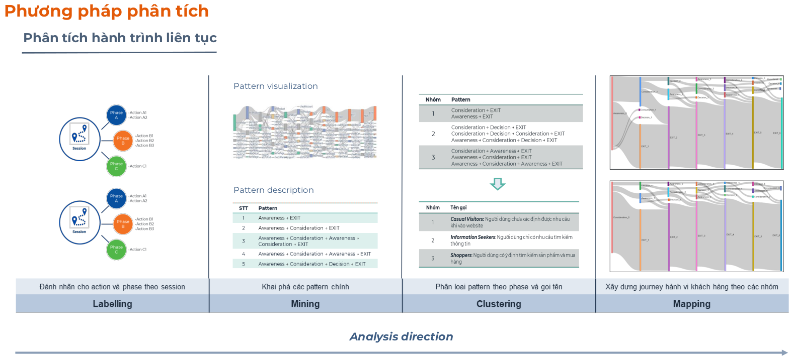
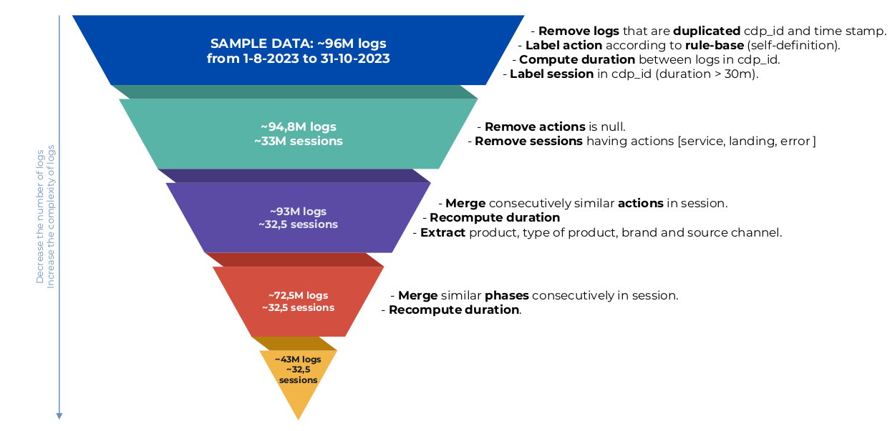
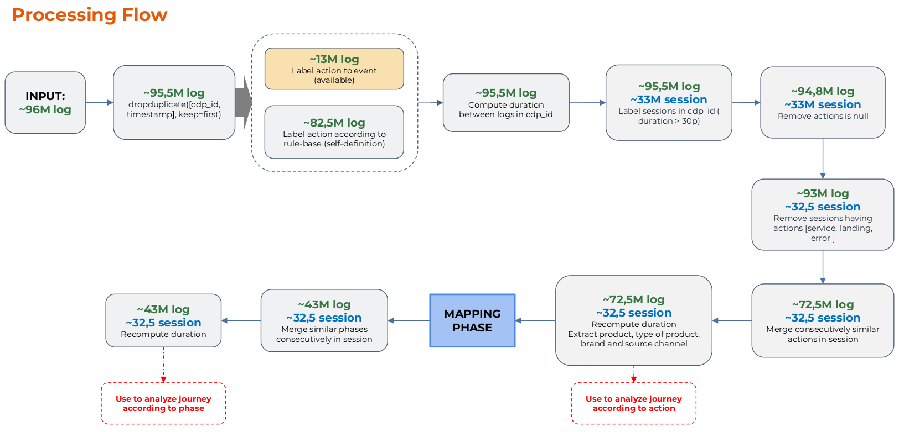
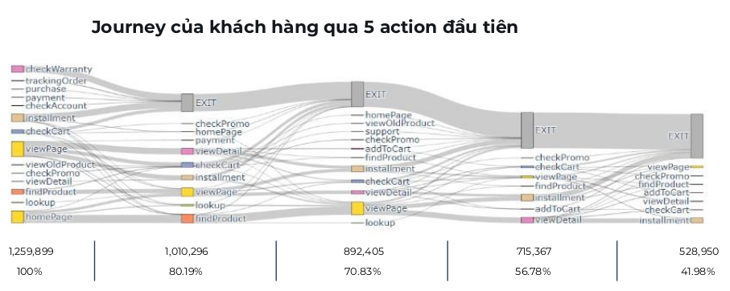
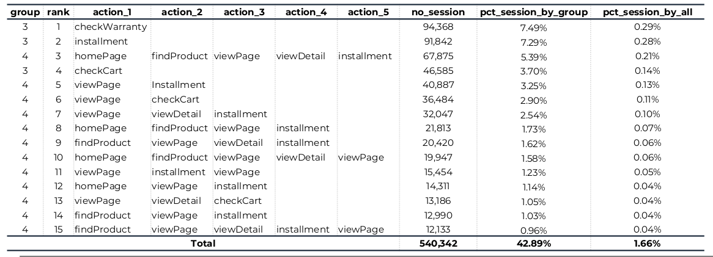
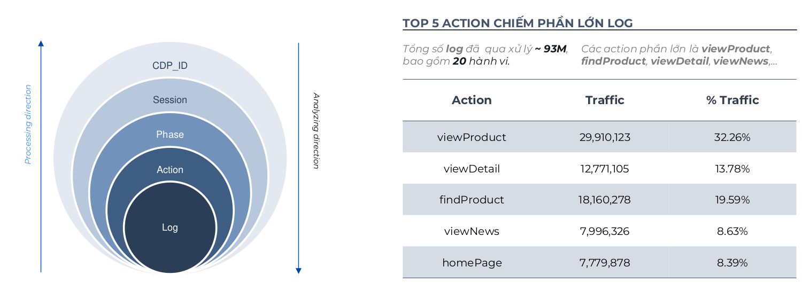
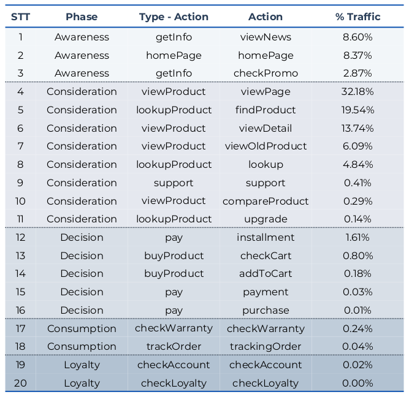

# Web Behavior Analytics — Customer Journey Mapping & Exit-Intent Prediction

> **Note:** This project was developed at **CADS - FPT** for FPT Shop (fptshop.com.vn). The repository contains notebooks and utilities revised from the original internal project.

## Highlights

- **96M raw web logs** processed into **93M labeled actions** across **32.5M user sessions** over 3 months
- **62.9% precision** and **58.9% recall** on step-level exit-intent prediction — **+27.7 pp** over random baseline
- **20-action labeling framework** mapped from raw URLs/events to structured user behaviors
- **5-phase customer journey model**: Awareness → Consideration → Decision → Consumption → Loyalty
- **3 behavioral segments** identified: Information Seekers (25%), Product Explorers (70%), Shoppers (4%)
- Actionable business recommendations for real-time personalization and exit intervention

---

## Methodology



### Data Processing Pipeline





---

## Results

### Data Scale

| Stage | Volume |
|---|---|
| Raw logs (Aug–Oct 2023) | ~96M |
| Valid labeled logs | ~93M |
| Valid sessions | ~32.5M |
| Labeled actions | 20 |

### Key Behavioral Insights

| Insight | Detail |
|---|---|
| Purchase sessions | **2.8%** of all sessions |
| Purchase action timing | Most between **2nd–5th action** in session |
| Session duration | **>90%** of sessions last 0–5 minutes |
| Page dwell time | **>50%** of pages viewed for 0–15 seconds |
| Peak traffic windows | 9–11, 14–16, 19–21 (54% of traffic) |
| Journey phases | Consideration 77.2%, Decision 2.6% |
| Product interest | Smartphones **58%**, Laptops **24%** |
| Products viewed/session | 1–5 products (**98.7%** of sessions) |
| Entry source | Search ~50%, Direct ~20% |
| Top 5 actions | viewProduct (32.3%), findProduct (19.6%), viewDetail (13.8%), viewNews (8.6%), homePage (8.4%) |

### Behavioral Segmentation

| Segment | Traffic Share | Avg. Session Duration | Characteristics |
|---|---|---|---|
| Information Seekers | 25.04% | 0.9s | Quick browse, news/homepage oriented |
| Product Explorers | 69.65% | 98s | Product browsing, comparison, search-heavy |
| Shoppers | 3.87% | 297s | Cart, payment, purchase — highest intent |

### Exit-Intent Prediction

| Level | Metric | Rule-Based Model | Random Baseline | Improvement |
|---|---|---|---|---|
| **Step-level** | Precision | **62.9%** | 35.2% | +27.7 pp |
| | Recall | **58.9%** | 50.0% | +8.9 pp |
| | F1-score | **60.8%** | 41.3% | +19.5 pp |
| **Session-level** | Precision | **68.3%** | 46.4% | +21.9 pp |
| | Recall | **65.6%** | 50.0% | +15.6 pp |
| | F1-score | **66.9%** | 48.1% | +18.8 pp |

Stability verified via two-sample checks — differences < 1.1%.

---

## Journey Mapping



### Customer Journey Model

```
log → action → phase → session
```

Each session is reconstructed by grouping consecutive logs with ≤30 minute inactivity gaps. Actions are mapped to 5 journey phases:

| Phase | Actions | Description |
|---|---|---|
| **Awareness** | homePage, viewNews, checkPromo | Initial exposure and information gathering |
| **Consideration** | viewProduct, findProduct, viewDetail, compareProduct, lookup, upgrade, support | Product research and evaluation — **77.2% of all traffic** |
| **Decision** | addToCart, checkCart, installment, payment, purchase | Purchase-related actions — **2.6% of traffic** |
| **Consumption** | checkWarranty, trackingOrder | Post-purchase follow-up |
| **Loyalty** | checkAccount, checkLoyalty | Account management and loyalty engagement |

### Journey Patterns

- **~80%** of sessions exit after the first phase
- **~6%** of sessions reach the Decision phase
- Sessions with **2–5 phases** represent **70.8%** of purchase sessions
- Sessions with **6+ phases** have the highest purchase rate: **58.33%**

### Top Actions







---

## Approach

### 1. Market Research

Reviewed academic research and industry case studies on clickstream analytics, in-session marketing, purchase intent prediction, and exit-intent detection. Benchmarked against state-of-the-art approaches including decision trees (AUC ~97%), random forests (AUC 84–89%), and XGBoost (F1 73–79%).

Key industry benchmarks: in-session marketing lifts conversion by 1–4.2%, revenue-per-visitor by 20.2%, and conversion rate by 23.4%.

### 2. Data Cleaning & Preprocessing

- Removed duplicate, invalid, error, service, and irrelevant logs
- Removed null/unclassified actions (~600K logs, ~0.001%)
- Reconstructed sessions by inactivity threshold (30 minutes)
- Recomputed session and action durations after cleaning
- Extracted product category/type, brand, source channel, and campaign features

### 3. Action Labeling

Built a rule-based framework mapping raw URLs and event labels to 20 structured user actions:

| Category | Actions |
|---|---|
| Product Discovery | homePage, findProduct, viewProduct, viewDetail, viewOldProduct, compareProduct, upgrade |
| Purchase | addToCart, checkCart, installment, payment, purchase |
| Information | viewNews, checkPromo, support, lookup |
| Post-Purchase | checkWarranty, trackingOrder |
| Loyalty | checkAccount, checkLoyalty |

### 4. Journey Mapping

Built `log → action → phase → session` mapping:
- **Step 1:** Grouped consecutive logs with the same action label
- **Step 2:** Grouped consecutive actions into phases
- **Step 3:** Connected phases sequentially within each session

### 5. Behavioral Segmentation

Segmented users into 3 groups based on observed behavior patterns, session depth, and purchase signals.

### 6. Exit-Intent Prediction

- Extracted journey patterns from 32.2M training sessions
- Identified exit patterns from 3M exit sequences (1–10 logs)
- Predicted exit probability at each step for 924K steps across 325K test sessions
- Compared rule-based method (pattern matching against historical exits) vs. random baseline

---

## Business Recommendations

| Recommendation | Rationale |
|---|---|
| Intervene in first **0–5 minutes** | >90% of sessions fall in this window |
| Trigger on early high-intent signals | Search, repeated product-detail views, cart/payment events |
| Focus on Product Explorers & Shoppers | Avoid broad promotions; target users showing intent |
| Segment by purchase probability | Low / Medium / High — tailor intervention intensity |
| Exit-intent triggers | Popup, reminder, sign-up prompt, recommendation, social proof |
| Time campaigns to peak windows | 9–11, 14–16, 19–21 |
| Combine current + historical behavior | Stronger intent prediction with user history |
| Reduce UX friction | Use journey data to improve navigation, content placement, checkout flow |

---

## Project Structure

```text
.
├── docs/                              # Methodology, journey, and analysis figures
├── notebooks/                         # Analysis notebooks
└── README.md
```
